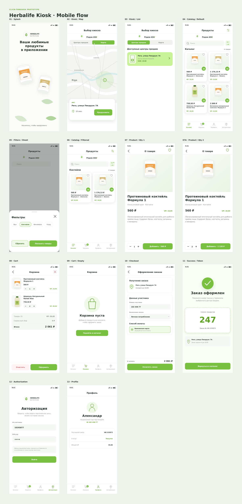
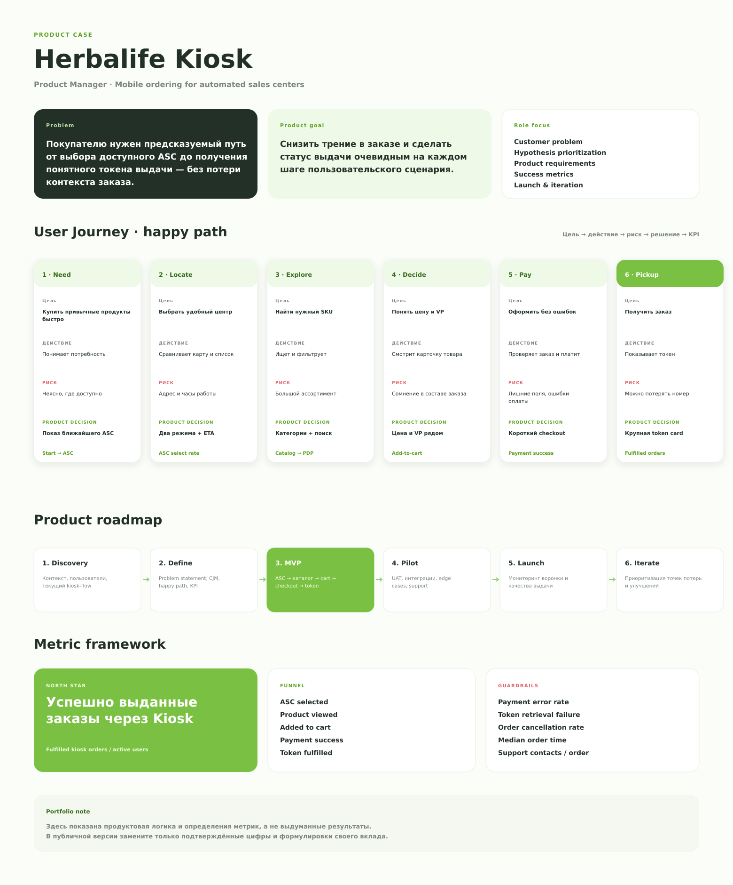

# Herbalife Kiosk — AI-assisted Product Prototype

Интерактивный portfolio case, показывающий, как Product Manager превращает продуктовую гипотезу в проверяемый начальный прототип с помощью generative AI — до подключения полноценной команды дизайна и разработки.

> Моя роль: постановка продуктовой задачи, определение happy path, структура User Journey, приоритизация состояний, KPI framework, критерии качества и итерационная проверка результата. AI использовался как инструмент ускорения прототипирования, генерации SVG, подготовки Figma-плагина и документации.



## Ограничения

- Демонстрационный click-through прототип без backend и реальных транзакций.
- Прототип собран заново по публично доступным экранам и материалам приложения. Он не содержит исходного кода, внутренних данных и production-аналитики продукта.
- Метрики ниже — определения и рамка измерения, а не заявления о фактических результатах.
- Визуальные и продуктовые решения используются только для некоммерческого портфолио. Товарные знаки принадлежат их владельцам — см. [NOTICE.md](NOTICE.md).

## Продуктовая задача

Пользователю нужен предсказуемый путь от выбора доступного автоматизированного центра продаж до получения понятного токена выдачи. Ключевой риск — потеря контекста между выбором точки, составом заказа, оплатой и фактическим получением товара.

Продуктовая цель начального прототипа — проверить, понятен ли пользователю основной сценарий и достаточно ли информации на каждом шаге для следующего действия.

## Что демонстрирует проект

- 14 мобильных экранов и состояний;
- 38 кликабельных переходов;
- happy path: `Splash → ASC → Catalog → Product → Cart → Checkout → Token`;
- отдельные состояния фильтров, количества товара, пустой корзины, авторизации и профиля;
- User Journey с целями, действиями, рисками, продуктовыми решениями и KPI;
- North Star, funnel metrics и guardrails без выдуманных результатов;
- автономный SVG-first Figma-плагин, работающий без сетевых запросов;
- web-прототип, который можно опубликовать через GitHub Pages.

## Моя роль как Product Manager

1. Сформулировал problem statement и цель прототипа.
2. Выделил основной пользовательский сценарий и дополнительные состояния.
3. Разложил путь пользователя на этапы, риски и продуктовые решения.
4. Определил структуру экранов и приоритет кликабельных переходов.
5. Сформировал metric framework: North Star, funnel и guardrails.
6. Задал AI ограничения по визуальному стилю, данным, состояниям и формату результата.
7. Итерационно проверил тексты, расчёты, переходы, SVG и структуру Figma-плагина.

## Как использовался AI

| Этап | Решение Product Manager | Роль AI | Результат |
|---|---|---|---|
| Problem framing | Определить проблему, границы и цель прототипа | Структурировать материалы и варианты формулировок | Problem statement и scope |
| User flow | Выбрать happy path и edge states | Разложить сценарий на экраны и переходы | Карта из 14 состояний |
| Rapid prototyping | Определить контент, hierarchy и acceptance criteria | Сгенерировать и итерационно улучшить SVG | Click-through визуальный прототип |
| Product story | Определить решения, гипотезы и метрики | Помочь оформить CJM и KPI framework | Портфолио-страница Product Story |
| Figma delivery | Определить структуру файла и ожидаемое поведение | Подготовить код локального плагина | 3 Figma-страницы и 38 hotspots |
| QA | Определить, что считается рабочим результатом | Автоматизировать проверки синтаксиса и ссылок | Воспроизводимый пакет |

AI не заменял продуктовые решения. Он ускорял перевод решений в артефакт, который можно показать пользователям, заказчику или команде и затем улучшать по обратной связи.

## User Journey



Путь разделён на шесть этапов:

1. **Need** — сформировать потребность.
2. **Locate** — выбрать доступный ASC.
3. **Explore** — найти нужный SKU.
4. **Decide** — понять цену и VP.
5. **Pay** — оформить заказ без ошибок.
6. **Pickup** — получить товар по токену.

Для каждого этапа зафиксированы цель пользователя, действие, риск, продуктовое решение и измеримый сигнал.

## Metric framework

**North Star:** успешно выданные заказы через Kiosk.

**Funnel:** `ASC selected → Product viewed → Added to cart → Payment success → Token fulfilled`

**Guardrails:** payment error rate, token retrieval failure, order cancellation rate, median order time, support contacts per order.

Это определения метрик и рамка измерения, а не заявления о фактических результатах.

## Запуск web-прототипа

Откройте `index.html` в браузере или включите GitHub Pages для ветки `main` и корневой папки `/`.

## Запуск Figma-плагина

1. Откройте Figma Desktop и нужный Design-файл.
2. Выберите `Plugins → Development → Import plugin from manifest…`.
3. Укажите `manifest.json` из корня репозитория.
4. Запустите `Herbalife Kiosk — Portfolio Builder`.
5. Нажмите «Собрать прототип».
6. На странице `01 Prototype` запустите Present. Стартовая точка — `Herbalife Kiosk — Happy Path`.

Плагин создаёт:

- `00 Foundations` — токены и UI-паттерны;
- `01 Prototype` — мобильные экраны и прототипные переходы;
- `02 Product Story` — problem framing, User Journey, roadmap и metric framework.

При повторном запуске заменяются только слои, созданные плагином. Пользовательский контент не удаляется.

## Структура репозитория

```
├── index.html              # Интерактивный web-прототип
├── manifest.json           # Манифест локального Figma-плагина
├── code.js                 # Готовая сборка плагина
├── ui.html                 # UI плагина
├── prototype-map.json      # Экраны, hotspots и направления переходов
├── svg/                    # 17 автономных SVG: 14 экранов и 3 борда
├── preview/                # Изображения для README
├── scripts/                # Генерация и валидация
├── src/                    # Исходный шаблон плагина
└── NOTICE.md               # Уведомление о товарных знаках
```

## Проверка и пересборка

```
npm run build
npm run check
```

Последняя проверка: 17 SVG-файлов, 14 экранов, 38 переходов, валидный JavaScript.

## Компетенции

`AI-assisted product discovery` · `Prompt design` · `Rapid prototyping` · `CJM` · `Product metrics` · `Figma` · `SVG` · `AI output evaluation` · `Documentation`

## Связанные кейсы

- [b2b-logistics-request-lifecycle](https://github.com/mamorudreamer/b2b-logistics-request-lifecycle) — процесс в BPMN и жизненный цикл заявки в UML.
- [logistics-data-model](https://github.com/mamorudreamer/logistics-data-model) — схема данных, ERD и аналитические SQL-запросы.
- [academy-shop-ai-product-prototype](https://github.com/mamorudreamer/academy-shop-ai-product-prototype) — e-commerce-прототип и продуктовый кейс.

## Автор

Александр Кирилов — [github.com/mamorudreamer](https://github.com/mamorudreamer)
